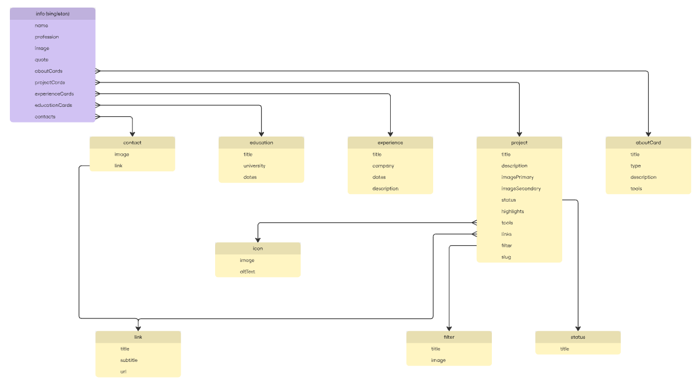
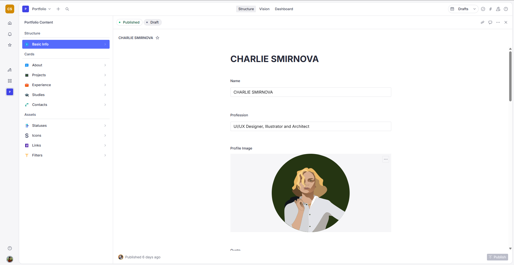

# 📔Charlie's Portfolio CMS

This project is created to configure [Sanity](https://www.sanity.io/) Schema for Charlie's personal portfolio. It has all the content displayed on the website, including projects, experience, education and some visuals and basic info.

The schema was designed in collaboration with [GudokVlad](https://github.com/GudokVlad-Pilot), who also implementeded, maintained and deployed schema to Sanity Studio.

The project is supporting CMS for [Personal Portfolio](https://github.com/charliesmir/portfolio-charlie). Here is the link to the website: [Charlie's Portfolio](https://www.charliesmir.com/).

## 🏗️ The Architecture of the App

### 📂 Project structure

```bash
.
├── schemaTypes/
│ ├── aboutCard.ts        # About Cards content
│ ├── contact.ts          # Contacts information
│ ├── eductation.ts       # Education content
│ ├── experience.ts       # Experience content
│ ├── filter.ts           # Filters for the projects
│ ├── icon.ts             # Image assets with Alt Text for About Cards
│ ├── index.ts            # Schema Types definition
│ ├── info.ts             # Main type with basic info and sort of the rest of the content
│ ├── link.ts             # Links for other types
│ ├── project.ts          # Project Cards content
│ └── status.ts           # Status of the project
├── static/
│ └── .gitkeep
├── .gitignore
├── eslint.config.mjs
├── package-lock.json
├── package.json          # Dependencies used in the project
├── README.md             # Readme file you are reading now :)
├── sanity.cli.ts
├── sanity.config.ts      # Configuration of the schema with structure in Studio
└── tsconfig.json
```



### 🧭 Sanity Navigation Structure

The structure follows the pattern where the content is split into three groups: "Structure", "Cards" and "Assets". "Assets" are just collections of different tags and images that are used in cards. "Cards" are used to fill with the content of the different portfolio sections. "Structure" is having all the basic info that is displayed on the website as well as the order of the cards.



## 🎅 Credits

- **Charlie**  
  _CMS Operator & Schema Designer_  
  Owner of the repositiry, designed Sanity Schema and populated Studio with content.

  [GitHub](https://github.com/charliesmir)  
  [Portfolio](https://www.charliesmir.com/)

- **GudokVlad**  
  _Developer & Maintainer_  
  Implemented Sanity Schema and deployed to Studio.

  [GitHub](https://github.com/GudokVlad-Pilot)  
  [Portfolio](https://gudokvlad.com/)
